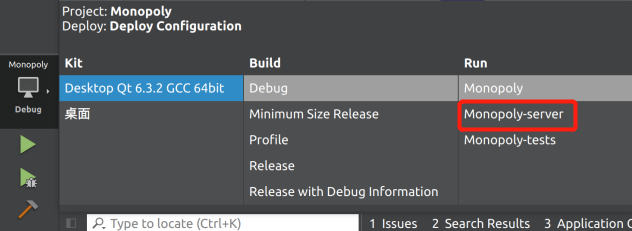
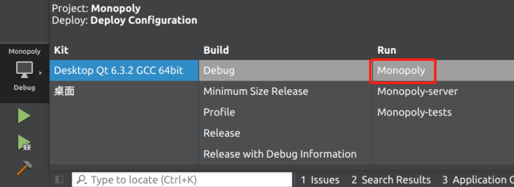

# Monopoly

Code base for the Monopoly game implementation of ETH-Zurich Software Engineering course.

## Team Members

- Yize Cheng (chengyi@student.ethz.ch)
- Ruida Wang (ruidwang@student.ethz.ch)
- Yuxin Hu (yuxihu@student.ethz.ch)
- Zheqi Shen (shenzh@student.ethz.ch)
- Zhicheng Xiong (xzhicheng@student.ethz.ch)
## Requirements

- **System Requirements**: Ubuntu 20.04 or macOS are supported. Windows is **not** supported.
- **Build Requirements**: We used Qt for our GUI devlopment. The project can only be built using Qt with CMake.
    - CMake
    - Qt: Please download and install Qt from the official website. We are using Qt 6.3.2 with the following packages: (The package names are categorized in the same way that you can expect to see from the Qt Maintanance Tool)
        - Qt Design Studio:
            - Qt Design Studio 4.1.0
        - Qt:
            - Qt 6.3.2:
                - Desktop gcc 64-bit
                - Sources
                - Qt5 Compatibility module
                - Additional Libraries:
                    - Qt MultiMedia
                - Qt Debug Information Files
        - Developer and Designer Tools:
            - Qt Creator 10.0.1
            - Qt Creator 10.0.1 Debug Symbols
            - Qt Creator 10.0.1 Plugin Development
            - CMake 3.24.2
            - Ninja 1.10.2
    - Make sure that `sockpp` is first built before building the monopoly project
- **Display Requirements**: The game currently only support "Light Mode Display". You may not be able to properly see some images or characters if "Dark Mode Display" is used.

## Build Instructions
1. Please first build `sockpp`.
2. Open Qt Creator, click "Open project", and choose the `CMakeList.txt` file in the repository's root directory.
3. Properly configure the project by choosing the "Desktop Qt 6.3.2 GCC 64 bit" build environment.
4. Click the "hammer" on the bottom left to build monopoly. 

    
5. First build and run monopoly server:

    

    After choosing "Monopoly-server" in the run configurations, click the green triangle to run the server.

    

6. Then build and run the monopoly client:

    

    After choosing "Monopoly" in the run configurations, click the same green triangle to run the client application.

## Known Issues
1. Currently, the situation where one of the players completely shut down his/her client communication can not be handled. This is a problem inherited from Lama since the inherited communication code cannot solve this issue.
